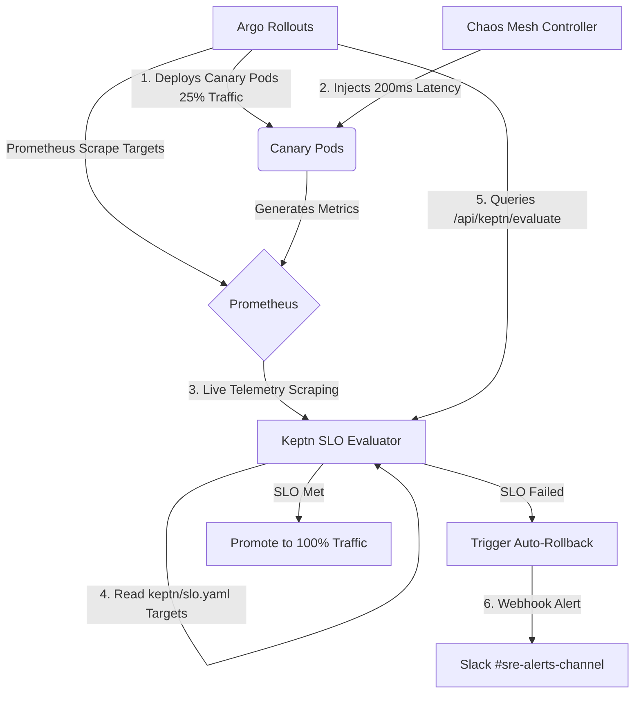
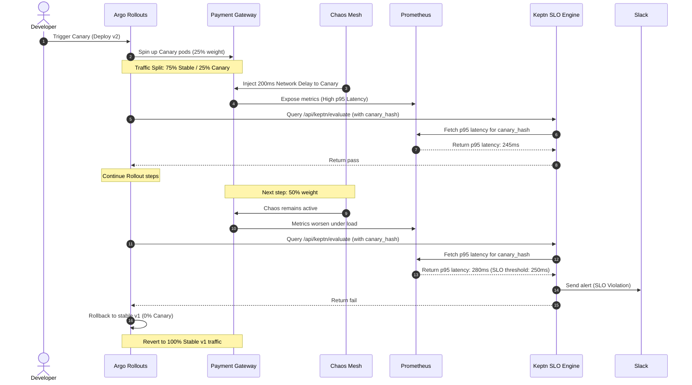
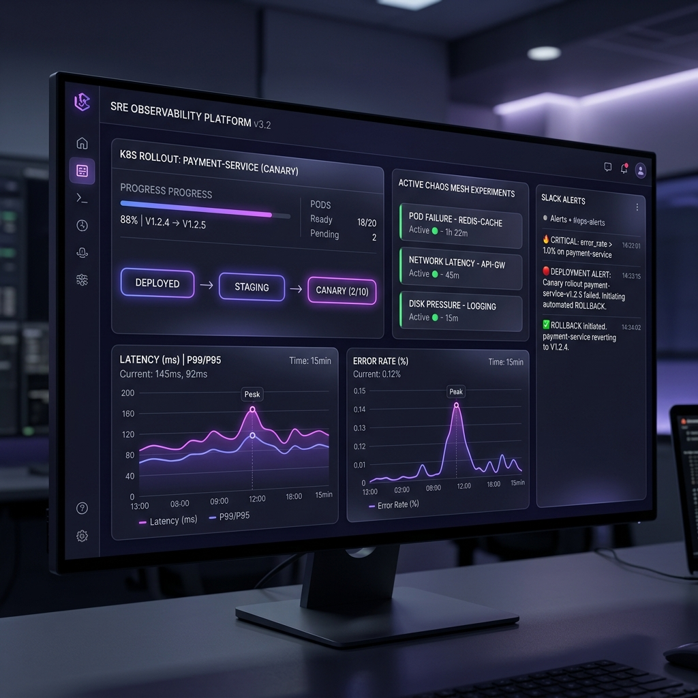

# ⚙️ Chaos Engineering & Auto-Remediation Platform

Establish a continuous chaos injection pipeline with automated canary deployments and real-time auto-remediation loops triggered by Service Level Objective (SLO) violations.

---

## 🏗️ Production Architecture & Traffic Flows

The diagram below shows how the progressive delivery engine (Argo Rollouts) works in tandem with the Chaos Mesh injection engine and the Keptn SLO evaluation webhook:



---

## ⏱️ Telemetry & Auto-Remediation Sequence

The following timeline illustrates the sequence of actions from a deployment trigger, to network fault injection, metrics degradation, evaluation failure, and automated rollback:



---

## 📈 Keptn SLO Scorecard & Decision Matrix

The platform evaluates objectives parsed from `keptn/slo.yaml` and maps them to immediate automated remediation actions:

| Score (SLO Compliance) | Status | Remediation Action | Slack Alert Level |
| :--- | :--- | :--- | :--- |
| **90% - 100%** | `Pass` | Promote rollout to next traffic weight step | `Info` (Green webhook message) |
| **50% - 89%** | `Warning` | Hold rollout at current weight step, double scrape frequency | `Warning` (Yellow webhook message) |
| **< 50%** | `Fail` | Instantly abort rollout & restore previous stable build | `Critical` (Red webhook message + pager) |

---

## 🖥️ Premium SRE Dashboard Mockup

Below is a preview of the premium SRE Dashboard and Chaos Mesh management center deployed inside the cluster:



---

## 🔗 Live Access Endpoints & Credentials

Below are the direct URLs and credentials for all external consoles and dashboards deployed in the cluster:

| Service / Tool | Direct Web Link (Openable) | Credentials / Token | Port Forward Backup Command |
| :--- | :--- | :--- | :--- |
| 🖥️ **SRE Dashboard (Flask UI)** | [http://192.168.58.2:30500](http://192.168.58.2:30500) | *No Authentication* | `kubectl port-forward svc/sre-dashboard 5000:5000` |
| 🌀 **Chaos Mesh Dashboard** | [http://192.168.58.2:31655](http://192.168.58.2:31655) | Use generated token (see below) | `kubectl port-forward -n chaos-mesh svc/chaos-dashboard 2333:2333` |
| ⛵ **Argo CD Control Plane** | [http://192.168.58.2:30792](http://192.168.58.2:30792) | **User:** `admin`<br>**Pass:** `aFnhCyYdeOes5xSj` | `kubectl port-forward -n argocd svc/argocd-server 8080:80` |
| 📊 **Grafana Metrics Console** | [http://192.168.58.2:31368](http://192.168.58.2:31368) | **User:** `admin`<br>**Pass:** `HG4kMRvI8w2brVmYK1MS08XhhNw1IGKtTE8Qpw1V` | `kubectl port-forward -n monitoring svc/prometheus-operator-grafana 3000:80` |
| 📈 **Prometheus Console** | [http://192.168.58.2:32587](http://192.168.58.2:32587) | *No Authentication* | `kubectl port-forward -n monitoring svc/prometheus-operator-kube-p-prometheus 9090:9090` |
| 💳 **Payment Gateway API** | [http://192.168.58.2:30501/pay](http://192.168.58.2:30501/pay) | *No Authentication (JSON Post)* | *Exposed directly on NodePort* |

### 🔑 Chaos Mesh Dashboard Login Token
Copy and paste this token into the Chaos Mesh Dashboard login page:
```text
eyJhbGciOiJSUzI1NiIsImtpZCI6InNVTm5Zb3g2R2FaNzFYeVNGZThVZ3ZUX2xnd2VxU1hTQWl1dWJaSmRHRWcifQ.eyJhdWQiOlsiaHR0cHM6Ly9rdWJlcm5ldGVzLmRlZmF1bHQuc3ZjLmNsdXN0ZXIubG9jYWwiXSwiZXhwIjoxODEyNTIyMDA4LCJpYXQiOjE3ODA5ODYwMDgsImlzcyI6Imh0dHBzOi8va3ViZXJuZXRlcy5kZWZhdWx0LnN2Yy5jbHVzdGVyLmxvY2FsIiwianRpIjoiMWNiZWM2YmYtMDdjOC00YTNkLTljMDEtM2Y5ZDllYmZhNWI3Iiwia3ViZXJuZXRlcy5pbyI6eyJuYW1lc3BhY2UiOiJjaGFvcy1tZXNoIiwic2VydmljZWFjY291bnQiOnsibmFtZSI6ImNoYW9zLWRhc2hib2FyZCIsInVpZCI6ImIwZTdiZTEyLThmMzctNDVhNi1iOTJkLThlMGY0N2RmZThiNCJ9fSwibmJmIjoxNzgwOTg2MDA4LCJzdWIiOiJzeXN0ZW06c2VydmljZWFjY291bnQ6Y2hhb3MtbWVzaDpjaGFvcy1kYXNoYm9hcmQifQ.ELYkwMVWN9KQdQ3iV02eMxRiNowJmXHnE-s5oK0JLwHnCm0AsPZrrnGZVVAHNHg2r7_gAvZWrQLJ2QM3VIKXxuh66lJbxTgHqaV6v01W7khD2qLyEGD8fxm_ymEen2q6ELCkcU-A0FDLKVPT3XX4UfDfOAfzbWU3qBTZA3Q8sgJWejFBOu9xA8WjOCRkrXaGSiXrc9BLBOvnowj0Rb9CzjNVWAdkvomuB-0qKrXe5Cara0zMKctEh1b9jNeEd2jsNbASM5D4n2x4rQa1titI-KPHAiJIZ_VIo8T5BOLEuE5XAOPi__TMk8Ru5wofZaCfHwLyZCRIjTXVeXSzyyB7nQ
```
> [!TIP]
> Tokens expire occasionally. You can always generate a fresh token at any time by running:
> ```bash
> kubectl create token chaos-dashboard -n chaos-mesh --duration=8760h
> ```

---

## 🛠️ Flagship Tech Stack

| Category | Technology | Why This Tool (Rationale) & Configuration |
| :--- | :--- | :--- |
| **Chaos Injection Engine** | **Chaos Mesh** | Declares and manages pod and network fault injections natively via Kubernetes CRDs. Deployed in `chaos-mesh` namespace. |
| **Deployment Engine** | **Argo Rollouts** | Executes progressive canary traffic shifts and background metrics evaluations. Deployed in `argo-rollouts` namespace. |
| **SLO Evaluation** | **Keptn** | Standardizes service-level verification and budgets using shipyard & SLO config manifests. Simulated via SRE Dashboard Keptn server. |
| **Telemetry System** | **Prometheus & Grafana** | Captures application metrics (p95 latency, throughput, error rates) in real-time. Deployed in `monitoring` namespace. |
| **Notification Engine** | **Slack API / Webhooks** | Broadcasts alerts during rollbacks. Simulated via in-app dashboard stream and real outgoing webhook posts. |
| **GitOps / Orchestration** | **Argo CD** | Continuous delivery and sync tool ensuring application state matches git repo. Runs in `argocd` namespace. |
| **Local Cluster Env** | **Minikube & Kubernetes** | Single-node local cluster environment running Kubernetes. |
| **Containerization** | **Docker** | Used for building image templates (`sre-dashboard`, `payment-gateway`) and loading them into Minikube. |
| **Application Layer** | **Python & Flask** | Powering the microservices, custom Prometheus instrumented APIs, and the glassmorphic dashboard web application. |

---

## 📂 Blueprint Structure

```text
├── chaos/
│   ├── network_delay.yaml        # Chaos Mesh NetworkChaos definition template
│   └── pod_kill.yaml             # Chaos Mesh PodChaos definition template
├── kubernetes/
│   ├── rollouts/
│   │   ├── rollout.yaml          # Argo Rollout declaration & steps
│   │   └── analysis_template.yaml# Argo AnalysisTemplate calling Keptn web webhook
│   ├── service.yaml              # Main, stable, and canary services
│   ├── servicemonitor.yaml       # ServiceMonitor for Prometheus scraping
│   ├── prometheus-values.yaml    # Helm custom configuration values for Prometheus
│   └── sre-dashboard.yaml        # Deployment and RBAC rules for the SRE dashboard
├── keptn/
│   ├── shipyard.yaml             # Shipyard orchestration layout
│   └── slo.yaml                  # Latency and error rate SLO budgets
├── dashboards/
│   ├── chaos_dashboard.json      # Grafana dashboard panels JSON
│   └── sre_dashboard.png         # SRE dashboard screenshot mockup
├── payment-gateway/
│   ├── app.py                    # Payment gate Flask API with custom prometheus client
│   └── Dockerfile                # Target app Docker image builder
├── sre-dashboard/
│   ├── app.py                    # SRE dashboard & Keptn SLO server (Python/Flask)
│   ├── templates/index.html      # Premium Glassmorphism UI
│   └── Dockerfile                # SRE dashboard image builder
├── start.sh                      # Cluster bootstrap and installer script
└── stop.sh                       # Platform cleanup and teardown script
```

---

## 🚀 Getting Started

### 1. Bootstrap the cluster
To install all required operators and deploy the payment-gateway application along with the SRE dashboard, run:
```bash
./start.sh
```

### 2. Monitor Rollout Progress
Open the SRE Dashboard (directly at [http://192.168.58.2:30500](http://192.168.58.2:30500) or refer to the **Live Access Endpoints & Credentials** table above for all endpoints). It displays:
- Argo Rollout deployment status.
- Pod details (roles, IP, restarts).
- Real-time Prometheus metrics (latency & errors).
- Slack message board simulation.

### 3. Verify Rollback under Chaos
1. Trigger a deployment update (e.g. edit the image tag or version in `kubernetes/rollouts/rollout.yaml` to trigger a canary).
2. Go to the SRE Dashboard and click **⚡ Inject 200ms Latency**.
3. Chaos Mesh will target the newly created canary pods and slow down network traffic.
4. Watch the Prometheus chart and Keptn SLO Evaluator logs.
5. The p95 latency will exceed the `250ms` SLO threshold.
6. The Keptn Gate will fail the SLO check.
7. Argo Rollouts will immediately halt, initiate an automated rollback, and a rollback notification will pop up on the Slack console.
